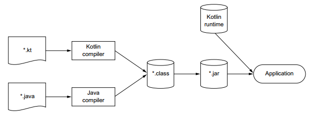

### Java interoperability

Kotlin and Java can be run at the same time, calling each other on the same runtime. As Java developers, we may not 
be able to convert our code bases in one shot, so that's a good news that we can do both without tricky configuration.  
One of the main goals of the designers of Kotlin was to make it fully interoperable with Java with no pain.

Here a scheme from the documentation that represent what can happened if you build Java + Kotlin code base.
 

Regarding to that scheme, in Kotlin you'll be able to extend, implement interfaces or inherit from Java classes in a 
blink. In the same row, you'll be able to do the same from Java, with Kotlin objects. So regardless the libraries 
you're working with, you'll be able to call Kotlin code through Java code, and vis-versa, effortlessly.

```kotlin
// Extension function on String
fun String.strLength() = this.length
```

```Java
// Calling the previous extension function from Java code
SandboxKt.strLength("Kotlin");
```

> Note that the name of the util class that contains our method `strLength` is based on the file that contains 
the extension function.

Plus, to provide such interoperability, Kotlin is often built upon the Java API to help you reuse your dependencies 
without refactoring everything (e.g. Kotlin's collection are built on top of Java's) collections.

If you want more details about Java interoperability, feel free to check out the documentation :
- [Calling Java code from Kotlin](https://kotlinlang.org/docs/reference/java-interop.html)
- [Calling Kotlin from Java](https://kotlinlang.org/docs/reference/java-to-kotlin-interop.html)
